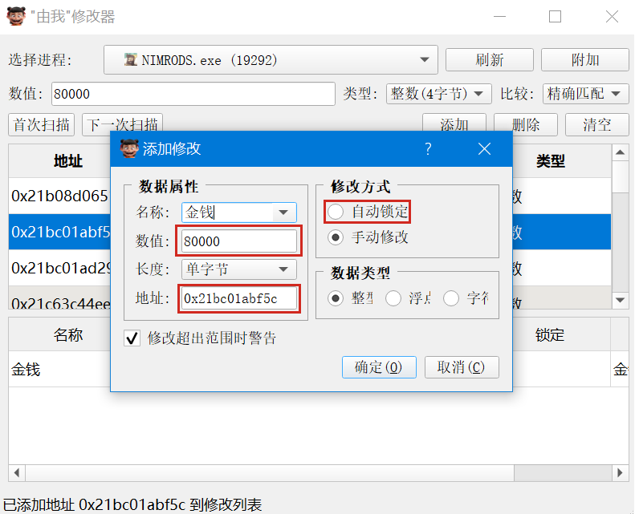

# “由我”修改器

当年玩游戏的邪派高手神器“金山游侠”多年不更新，已经不再支持现代游戏的修改。

近日被一款小众游戏折磨，一时兴起，就写了个游戏修改器Demo，让游戏苦手们可以扬眉吐气，不再被游戏折磨。

正所谓：

游戏虐我千百遍，我待游戏如初恋。
修改器开无敌键，我命**由我**不由天！

## 使用教程

### 基础使用

1. 从下拉列表选择目标游戏进程；
2. 点击"附加"连接到进程；
3. 在游戏中找到要修改的数值（选择适当的数值类型），填入搜索栏；
4. 进行首次扫描；
5. 在游戏中改变目标值，并使用"下一次扫描"缩小范围；
6. 找到目标地址后“添加”到结果栏修改或锁定数值；

### 搜索技巧

1. 数值类型选择：
   - 整数(4字节)：适用于等级、金钱等整数值
   - 浮点数：适用于坐标、速度等小数值
   - 双精度：适用于需要高精度的数值

2. 搜索模式：
   - 精确匹配：完全匹配输入值
   - 大于/小于：搜索范围值
   - 已改变：数值发生变化
   - 未改变：数值保持不变

3. 定位技巧：
   - 使用多次扫描逐步缩小范围
   - 观察数值变化规律
   - 注意相关联的数值

## 注意事项

- 必须以管理员权限运行
- 部分游戏可能有反作弊保护
- 使用本工具时请遵守相关法律法规
- 建议仅用于学习研究用途

## 开发说明

- 使用PyQt5构建界面
- 采用模块化设计
- 包含完整的错误处理和日志记录

## 许可证

MIT License